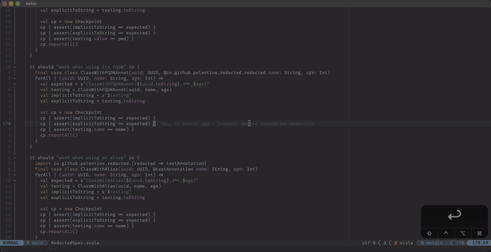
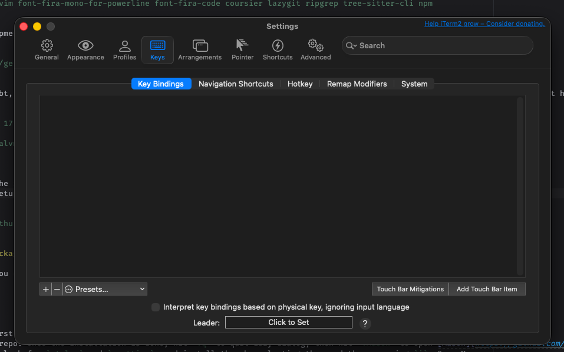
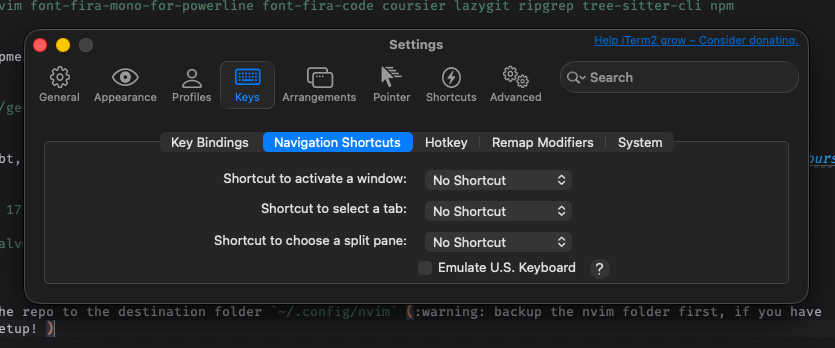
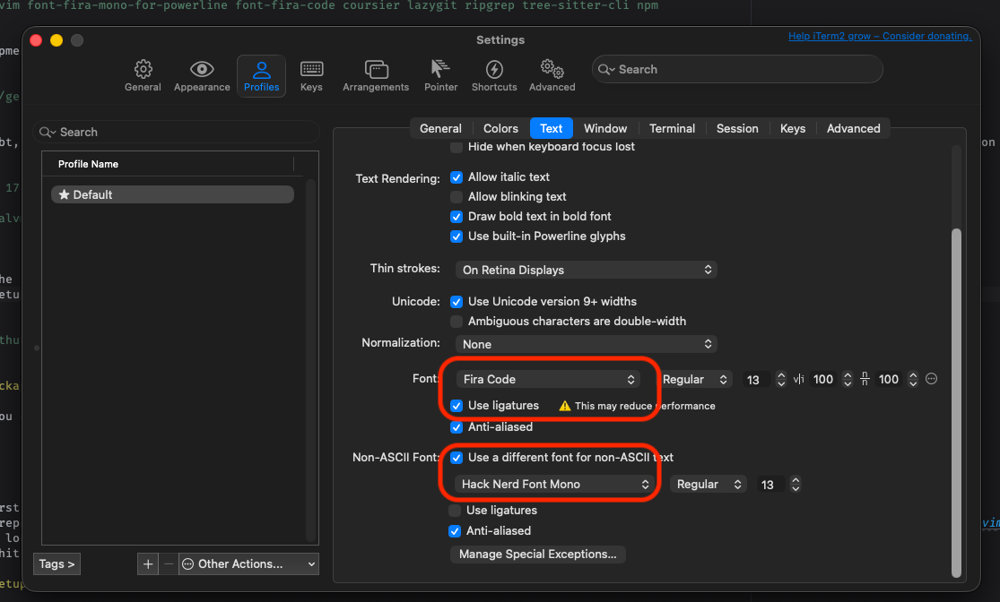
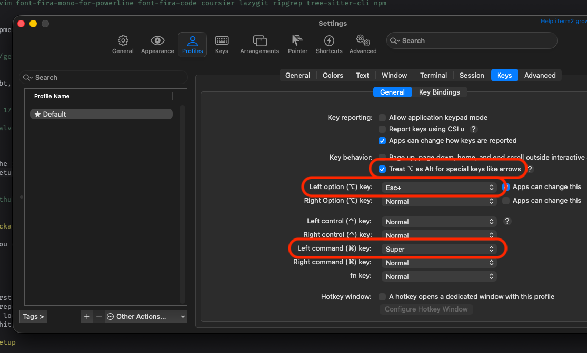
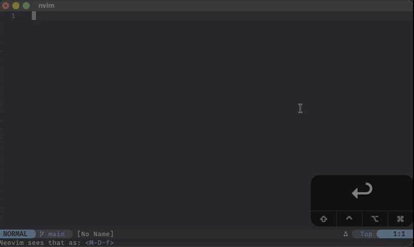

<div align="center">

[](https://github.com/neovim-idea/neovim-idea/releases)
[](http://www.lua.org)
[](https://neovim.io)

## neovim-idea

###### The neovim customization to resemble IntelliJ IDEA UX/UI :heart_eyes:



</div>

---

Featuring

- Metals integration, Autocompletion, Debugger support, execute code lenses
- Rename symbols, go to symbol definition / reference
- Projects integration with sessions persistence
- Ctrl+Tab file switcher, camel hump cursor movements
- Fuzzy search in files, Files search
- Git commands and Terminal UI
- Markdown rendering
- IntelliJ Dark & Matrix color scheme
- ... and more

---

<!-- TOC -->

- [READ THIS FIRST!](#read-this-first)
- [Setup](#setup)
  - [1. Install external dependencies](#1-install-external-dependencies)
  - [2. Install packages within neovim](#2-install-packages-within-neovim)
  - [3. Terminal setup](#3-terminal-setup)
  - [4. A note on Logitech MX Keys](#4-a-note-on-logitech-mx-keys)
  - [5. Start exploring your new setup!](#5-start-exploring-your-new-setup)
- [Default Shortcuts](#default-shortcuts)
- [Override Keymaps and Options](#override-keymaps-and-options)
- [Notes](#notes)
- [Things not supported](#things-not-supported)
  - [Setting a breakpoint inside lambda expressions](#setting-a-breakpoint-inside-lambda-expressions)
- [Miscellaneous](#miscellaneous)
- [Todo](#todo)
- [Buy me a :beer:](#buy-me-a-beer)
<!-- TOC -->

## READ THIS FIRST!

This is a very **personal and opinionated** customisation of neovim to resemble IntelliJ IDEA UI/UX, tailored towards
Scala development (does support Java as well, although I believe it would need extra configuration to support standalone
Java development).

Due to my work laptop being old, and with limited amount or RAM, having one instance of IntelliJ IDEA running along with
Chrome and Slack had become... problematic. Add to the mix dockerized instances of kafka/postgres/redis/amqp and so on,
and the system just turns downright unusable.

Because of that, I needed a **quick** replacement for IntelliJ to shave off those ~4GB of memory and keep me working,
while waiting for my Company to get a replacement. Obviously, [neovim](https://github.com/neovim/neovim) was the IDE of
choice.

> [!WARNING]
> Despite my (limited) previous knowledge of (neo)vim, I had nor the time or the inclination to learn a whole plethora
> of commands and shortcuts to be used in different modes. Call it laziness, old age or muscle memory. As a direct
> consequence of it, I brazenly messed with the key shortcuts in a way that any respectable neovim user would either
> get angry or weep in despair: using arrow keys and mouse whenever I can, writing the crappiest keymaps to shift
> neovim's development experience as close as could to IntelliJ. Sorry, not sorry, I've got work to do.

If you, however, think you can stomach that: enjoy the repo! Feel free to clone it and tweak it as you please :)

## Setup

### 1. Install external dependencies

Note: the following instructions require [homebrew](https://brew.sh/) installed and available in your system, so Linux & MacOS users
are covered. If you, however, are on Windows: 1) why? 2) please send a PR to improve this section :love_letter:

```bash
brew install neovim font-fira-mono-for-powerline font-fira-code coursier lazygit ripgrep tree-sitter-cli npm
```

For Scala development, you'd need to install also [sdkman](https://sdkman.io)

```bash
curl -s "https://get.sdkman.io" | bash
```

and then Java, sbt, visualVM (not required, but you do profile your app, right?). [Coursier](https://sdkman.io/sdks/coursier/) support hasn't landed yet on sdkman.

```bash
sdk install java 17.0.17-amzn
sdk install sbt
sdk install visualvm
```

And now, clone the repo to the destination folder `~/.config/nvim` ( :warning: backup the nvim folder first, if you have
a pre-existing setup! )

```bash
git clone git@github.com:neovim-idea/neovim-idea.git ~/.config/nvim
```

### 2. Install packages within neovim

At this point, you can finally run `neovim`:

```bash
nvim
```

Upon the very first run, neovim will install [lazy](https://github.com/folke/lazy.nvim), and all the necessary plugins
defined in this repo. Once the installation is done, hit `:q` to quit Lazy dialog, then hit `:Mason` to open [Mason](https://github.com/mason-org/mason.nvim):
you will need to look for `stylua` and `prettier`, and install them by selecting them and then pressing `i`. Once Mason
is done, simply hit `<Esc>` to quit it, and `:q` to quit neovim.

At this point, neovim is pretty much functional... but we need to tweak a bit the terminal, to make sure special keys
like `Cmd`, `Opt` and similar can actually be detected by neovim.

### 3. Terminal setup

It's important to understand that most of the keymaps used in this setup do need the `Cmd` / `Alt` and
`Opt` / `Start` keys to be forwarded to neovim. Sadly, some terminal emulators (such as iTerm) will capture them
to provide their own functionalities, such as swapping between terminal tabs. Because my IntelliJ setup does make heavy
usage of those keys, here below I'll describe how to forward them for iTerm; if you have other terminals, please leave a
PR to expand this documentation.

<details>
<summary>iTerm instructions</summary>

First of all, you need to remove all keybindings that iTerm has by default (and why not using [tmux instead?](https://github.com/tmux/tmux/wiki))



Then, you'd need to disable the navigation shortcuts



Then, change font settings to one that support gliphs and, if you like to see pretty symbols such as `≥` rather than `>=`,
enable also font ligatures



Last but not least, slightly change the key mappings



</details>

### 4. A note on Logitech MX Keys

In case you're using `Logitech MX Keys` in MacOS, you might have issues trying to figure out why `Fn` keys are still
modifying the brightness/volume/etc.. even though you you specifically toggled `on` MacOS's System Settings option
`use F1, F2 etc. keys as standard function keys`. No, you're not drunk: on my Company's old MBP i9 they worked fine but,
on my personal MBP M1, they didn't; seems like that, on the newer Apple Silicon MBPs, this setting is not honored
properly and therefore you must install [Logi Option+](https://www.logitech.com/en-us/software/logi-options-plus.html),
import your keyboad and then, under the `General` section .. toggle the twin setting called, you guessed it,
`use F1, F2 etc. keys as standard function keys`.

Go figure why :shrug:

### 5. Start exploring your new setup!

That's all! You can restart neovim, if you didn't already, and you're good to go!

## Default Shortcuts

> [!IMPORTANT]
> The following shortcuts require valid mapping to `M` (Cmd / Alt), `D` (Opt / Start) and `Fn` keys; you can quickly
> verify that your terminal recognises & forwards them properly to neovim by either:
>
> 1. press `F5`: that will execute a small debug utility that will listen & print any key combination or, if `F5`
>    isn't recognised either ...
> 2. ... type `:lua require("neovim-idea.actions").debug_keys_pressed()`, which will trigger the very same utility
> 3. press some key combination that uses Cmd/Opt modifiers, to make sure they're recognised properly

<details>
<summary>Example of how running the keymap debug utility in neovim</summary>



</details>

By default, `neovim-idea` associates the `<leader>` key to the Space key. If you don't like this setting, in the next
section you'll find all the information to change this, along with all the shortcuts and general options.

| Shortcut        | Mnemonics             | Description                                                 |
| :-------------- | :-------------------- | :---------------------------------------------------------- |
| `<M-D-CR>`      | `Cmd+Opt+Enter`       | Insert a new line above the current one                     |
| `<D-CR>`        | `Cmd+Enter`           | Insert a new line below the current one                     |
| `<M-S-Up>`      | `Opt+Shift+Up`        | Move the current line one up                                |
| `<M-S-Down>`    | `Opt+Shift+Down`      | Move the current line one up                                |
| `<D-x>`         | `Cmd+x`               | Cut selected text (or entire line, if nothing is selected)  |
| `<D-c>`         | `Cmd+c`               | Copy selected text (or entire line, if nothing is selected) |
| `<D-v>`         | `Cmd+v`               | Paste text starting from the cursor (or over selected text) |
| `<D-z>`         | `Cmd+z`               | Undo                                                        |
| `<D-d>`         | `Cmd+d`               | Duplicate current line (and moves cursor below)             |
| `<D-e>`         | `Cmd+e`               | Show LSP errors / warnings of the current line              |
| `<D-f>`         | `Cmd+f`               | Find files by name                                          |
| `<D-F>`         | `Cmd+Shift+f`         | Fuzzy find inside files                                     |
| `<M-Left>`      | `Opt+Left`            | Camelhump movement to the left                              |
| `<M-Right>`     | `Opt+Right`           | Camelhump movement to the right                             |
| `<M-BS>`        | `Opt+Backspace`       | Camelhump deletion to the left                              |
| `<M-Del>`       | `Opt+Delete`          | Camelhump deletion to the right                             |
| `<D-1>`         | `Cmd+1`               | Show / Hide Project Tree View                               |
| `<D-k1>`        | `Cmd+Numpad1`         | Show / Hide Project Tree View                               |
| `<D-p>`         | `Cmd+p`               | Pinpoint current file into Project Tree View                |
| `<D-b>`         | `Cmd+b`               | Toggle breakpoint in the current line                       |
| `<D-D>`         | `Cmd+Shift+d`         | Start / Continue a debugging session                        |
| `<D-4>`         | `Cmd+4`               | Show / Hide Debugger Adapter Protocol UI                    |
| `<D-k4>`        | `Cmd+Numpad4`         | Show / Hide Debugger Adapter Protocol UI                    |
| `<D-h>`         | `Cmd+h`               | Show API documentation of the symbol under cursor           |
| `<leader>gd`    | `Space+gd`            | Jump between symbol definition and usage                    |
| `<M-LeftMouse>` | `Cmd+LeftMouse`       | (\*) Jump between symbol definition and usage               |
| `<leader>gd`    | `Space+gr`            | Go to symbol references                                     |
| `<M-LeftMouse>` | `Cmd+Shift+LeftMouse` | (\*) Go to symbol references                                |
| `<M+CR>`        | `Opt+Enter`           | Run available Code Actions in the current line              |
| `<F18>`         | `Shift+F6`            | Rename the current symbol under cursor                      |
| `<leader>gp`    | `Space+gp`            | Git Preview Hunk                                            |
| `<leader>gu`    | `Space+gu`            | Git Undo (Revert) Hunk                                      |
| `<leader>gt`    | `Space+gt`            | Git Toggle current line blame                               |
| `<leader>gb`    | `Space+gb`            | Git current file blame                                      |
| `<leader>pa`    | `Space+pa`            | Show all projects                                           |
| `<leader>pr`    | `Space+pr`            | Show recent projects                                        |
| `<M-D-l>`       | `Cmd+Opt+l`           | Format current file                                         |
| `<D-k>`         | `Cmd+k`               | Show Lazygit interface                                      |
| `<F60>`         | `Opt+F12`             | Show Lazygit interface                                      |
| `<D-/>`         | `Cmd+Slash`           | Comment / Uncomment current line or selected lines          |
| `<D-r>`         | `Cmd+r`               | Run Code Lens(es) in the current line                       |
| `<D-w>`         | `Cmd+w`               | Close current buffer (and saves it if needed)               |
| `<F5>`          | `F5`                  | Debug: capture and print any key combination                |

(\*) in MacOS, mouse events register differently the Cmd key modifier.

If you're completely new to neovim however, you'd still need to have a bit of learning: here's some links that may be
helpful to get started with neovim, and the plugin used in this repository

- Neovim
  - [Starting Guide](https://neovim.io/doc/user/starting.html)
  - [Quick Reference](https://neovim.io/doc/user/quickref.html)
- Language Server Protocol
  - [Mason.nvim](https://github.com/mason-org/mason.nvim) - package manager for LSPs, DAPs, linters & formatters
  - [Mason-lspconfig.nvim](https://github.com/mason-org/mason-lspconfig.nvim) - makes installing/configuring Mason easy
  - [nvim-lspconfig](https://github.com/neovim/nvim-lspconfig) - collection of LSP configurations
  - [nvim-metals](https://github.com/scalameta/nvim-metals) - the official LSP for Scala, DO NOT use the one from Mason
- [Debugger Adapter Protocol UI](https://github.com/rcarriga/nvim-dap-ui)
- Git integration
  - [Vim Fugitive](https://github.com/tpope/vim-fugitive) - execute any git command in neovim
  - [Gitsigns.nvim](https://github.com/lewis6991/gitsigns.nvim) - buffer integration with git
  - [Lazygit](https://github.com/jesseduffield/lazygit) - git TUI, integrated in neovim via [Lazygit](https://github.com/folke/snacks.nvim/blob/main/docs/lazygit.md)
- [lualine](https://github.com/nvim-lualine/lualine.nvim) - neovim statusline
- [neotree-nvim](https://github.com/nvim-neo-tree/neo-tree.nvim) - the treeview plugin
- [neovim-project](https://github.com/coffebar/neovim-project) - manages projects, keeps sessions of open files, etc...
- [statuscol.nvim](https://github.com/luukvbaal/statuscol.nvim) - configurable status column with actions
- [switcher-nvim](https://github.com/neovim-idea/switcher-nvim) - switch between open files like in IJ
- [camelhumps-nvim](https://github.com/neovim-idea/camelhumps-nvim) - Intellij-like `camelhump` cursor jumps
- [telescope.nvim](https://github.com/nvim-telescope/telescope.nvim) - Find, Filter, Preview, Pick anything
- [todo-comments](https://github.com/folke/todo-comments.nvim) - highlights comments in the code
- [nvim-treesitter](https://github.com/nvim-treesitter/nvim-treesitter) - treesitter integration for neovim
- [nvim-notify](https://github.com/rcarriga/nvim-notify) - configurable notification manager
- [which-key](https://github.com/folke/which-key.nvim) - shows available keybindings in a popup
- [catppuccin-reloaded-nvim](https://github.com/neovim-idea/catppuccin-reloaded-nvim) - Just like catppuccin, but extensible

## Override Keymaps and Options

`neovim-idea` comes "batteries included": it contains all the necessary plugins and configurations to mimic the UI/UX
that you would normally see in IntellIJ. However, should you feel the need to change some configurations options,
keymaps, or even add your own keymaps, you are highly encouraged to do so!

Simply create a file `~/.config/nvim/lua/overrides.lua` and return a Lua table that resembles the shapes of the tables
in `~/.config/nvim/lua/neovim-idea/keymaps.lua` and `~/.config/nvim/lua/neovim-idea/options.lua`.

Say, for example, that you want to:

1. change default indentation to `4` spaces
2. bind the action `debug_keys_pressed` to `F7` instead of `F5`
3. change the colorscheme to `catppuccin-matrix`, instead of `catppuccin-intellijdark`
4. add a new, custom function, that sends a `Hello World!` notification when `F5` or `F6` are pressed

```lua
-- ~/.config/nvim/lua/overrides.lua
vim.cmd("set tabstop=4")
vim.cmd("set softtabstop=4")
vim.cmd("set shiftwidth=4")

-- you can access the predefined actions, if you need it
local actions = require("neovim-idea.actions")

return {
  keymaps = {
    -- this overrides the `print_keys_pressed` debug utility already defined in `keymaps.lua`
    print_keys_pressed = {
      -- no need to provide the `mode`, `action` and `opts` fields, if they don't change
      lhs = "<F7>",
      action = actions.debug_keys_pressed, -- not required! it's here just to show how to use `actions`
    },
    -- here, we defined a brand new action called `notify_hello_world`
    notify_hello_world = {
      mode = { "n", "i" },
      lhs = { "<F5>", "<F6>" },
      action = function()
        vim.notify("Hello World!", vim.log.levels.INFO)
      end,
      opts = { noremap = true, silent = true, desc = "print 'Hello World!'" },
    },
  },
  -- let's override the default color scheme
  options = {
    colorscheme = "catppuccin-matrix",
  },
}

```

## Notes

:warning: Don't know the keymaps?

Just press spacebar and in 500ms (configurable) it will show an auto completable popup!

In case you'd like to enable Java development:

1. `brew install mvn`
2. from within neovim, type `:Mason` command and look for the `java-language-server`, then hit `i` to install
   (note: [needs at least Java18](https://github.com/georgewfraser/java-language-server/issues/273))
3. follow instructions from [lsp-config official documentation page](https://github.com/neovim/nvim-lspconfig/blob/master/doc/configs.md#java_language_server)

## Things not supported

Sadly there are things that are not supported

### Setting a breakpoint inside lambda expressions

In IntelliJ, when presented with a line like the following

```scala
val result = somelist.filter(x => filterPredicate(x)).map(v => v % 10)
```

you can choose whether set a breakpoint not only at line level, but also at lambda expression level (thus being able to
capture `x` and/or `v`); this is, sadly, not possible with neovim, as far as my knowledge and research went so far.

However it is possible to set conditional breakpoints like so

> :DapSetBreakpoint --condition 'x == someValue'

## Miscellaneous

To keep your git branches lean and clean, you can automatically remove untracked remote branches (i.e. deleted after a
PR is merged) by setting

```bash
git config --global fetch.prune true
```

## Todo

- [x] project manager
- [ ] by default, when opening a project: open in order `README.md` or `build.sbt`
- [ ] keep insert mode after autocompletion
- [x] simple camel hump navigation
  - [x] extract logic in its own plugin
    - [x] add proper testing
  - [x] make own plugin to addd functional-style lua for easier development
- [ ] make neotree condense package folders
- [x] autosave buffers
  - [ ] `AutoSaveOnBlur` should also fire a neotree event in order to refresh the status of the file tree
- [ ] ~shortcuts to create new class/obj~ (`:MetalsNew{Java,Scala}File` does the trick)
- [x] shortcuts to implement all methods from trait/abstract class
- [x] undo with D-z
  - [ ] maybe find a proper neovim plugin?
- [x] make neotree stick to the left sidebar
  - [x] use https://github.com/folke/edgy.nvim
- [x] make the files open in the main content area
- [x] reshuffle the UI of dap
- [x] one single place to define all key combinations
- [x] unified way to define keymap (don't use two different APIs)
- [x] holding OPT while pressing `Backspace` / `Space` should "camelHump delete" to the left / right
- [x] holding OPT+SHIFT while pressing `LeftArrow` / `RightArrow` should "camelHump select" to the left / right
- [x] add shortcut to duplicate current line and place it below
- [x] SHIFT+UP/DOWN moves the current line up/down
- [x] use https://github.com/folke/snacks.nvim/tree/main/docs for lazygit
  - [x] terminal (?)
- [x] find out how to rename variables, classes
  - [ ] ~... and [files](https://github.com/folke/snacks.nvim/blob/main/docs/rename.md)~
- [x] show errors in the current line
- [x] click on a gutter to toggle a breakpoint creation on/off
- [ ] scratch files management for quick & dirty snippets
- [x] copy paste shortcuts using D-c, D-x, D-v
- [x] toggle comment/uncomment with <D-/>
- [x] use notification plugin to avoid losing focus from the buffer
  - [x] add telescope integration to retrieve notifications in case we need to copy/paste logs
- [x] plugin to mimic IntellIJ Idea quick open file selection with CTRL+TAB / CTRL+SHIFT+TAB
  - [x] bind mouse keys prev/next to cycle between open files
- [ ] global search & replace
- [x] when exiting lazygit, neotree should refresh its status icons
- [ ] highlight a line that has a breakpoint set
- [ ] update treesitter to `main` and figure out where the configuration options are now located

## Buy me a :beer:

BTC `12CQ1L7qQvF3pPXhAgomnSfWaVkL19nV5F`
